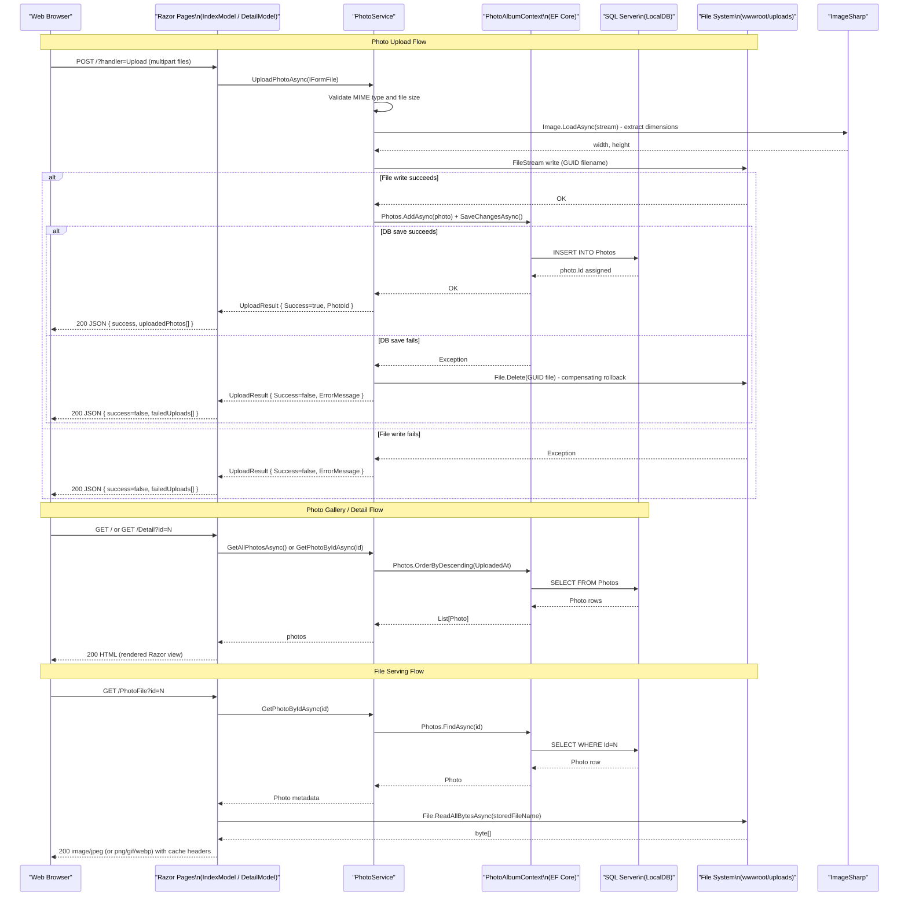

# API & Service Communication Contracts

PhotoAlbum exposes a small set of Razor Pages-based HTTP endpoints (5 handlers across 3 pages) using synchronous server-side request/response patterns with no inter-service communication.

## Service Catalog

| Service | Port | Category | Purpose |
|---------|------|----------|---------|
| PhotoAlbum Web | 5000 (HTTP) / 5001 (HTTPS) | Business | Serves the photo gallery UI, handles photo upload/retrieval/deletion, and serves binary image files |

## API Endpoints Inventory

| Service | Method | Path | Request Type | Response Type |
|---------|--------|------|-------------|--------------|
| PhotoAlbum Web | GET | `/` | — | HTML page (gallery grid with all photos) |
| PhotoAlbum Web | POST | `/?handler=Upload` | Multipart form-data (`List<IFormFile> files`) | JSON (`{ success, uploadedPhotos[], failedUploads[] }`) |
| PhotoAlbum Web | GET | `/Detail?id={id}` | Path query param `id: int` | HTML page (full-size photo + metadata + navigation) |
| PhotoAlbum Web | POST | `/Detail?handler=Delete&id={id}` | Form post with `id: int` | Redirect to `/` (302) |
| PhotoAlbum Web | GET | `/PhotoFile?id={id}` | Path query param `id: int` | Binary image file (Content-Type from stored MimeType) |

## Management & Observability Endpoints

| Service | Endpoint | Custom Metrics |
|---------|----------|---------------|
| PhotoAlbum Web | None configured | None |

No health check endpoints (`/health`, `/healthz`), Swagger UI, or metrics endpoints are configured. Observability relies solely on the built-in ASP.NET Core console logging via `ILogger<T>`.

## DTOs & Contracts

**Service-level models (single service, no gateway aggregation):**

- **`Photo`** (entity/response model) — Represents a stored photo returned to Razor Pages for display. Contains identity, file metadata, and image dimensions. Not exposed directly as a JSON API type; rendered server-side into HTML. Full field details are in `data-architecture.md`.
- **`UploadResult`** (internal result DTO) — Carries the outcome of a single file upload operation (success flag, created photo ID, error message) from `PhotoService` back to the `IndexModel` page handler. Not a C# record; mutable class. Not directly serialized to the client — the page handler projects it into an anonymous JSON object.

No OpenAPI/Swagger specification, protobuf schemas, or GraphQL schemas are present. The single JSON response (upload handler) uses `System.Text.Json` via ASP.NET Core's default `JsonResult` serializer with no custom configuration.

## Communication Patterns

**Synchronous (only):** All communication is in-process and synchronous (async/await over I/O). There is no inter-service HTTP communication, message broker, or event bus.

Request flow: Browser → ASP.NET Core Razor Pages pipeline → `IPhotoService` (scoped DI) → `PhotoAlbumContext` (EF Core) → SQL Server LocalDB + local file system.

**Resilience:** No circuit breaker, retry policy, or timeout configuration is applied beyond the default ASP.NET Core request timeout. On database save failure after a file write, the service performs a compensating delete of the written file (manual rollback pattern).

**Service discovery:** Not applicable — single-process application with no remote service calls.

**Security posture:** No authentication or authorization is configured. All endpoints are publicly accessible with no login requirement, no JWT/OAuth2, no API keys, and no RBAC. HTTPS redirection is enabled in production via `app.UseHttpsRedirection()`, and HSTS headers are set in non-development environments. There is no CSRF protection explicitly configured beyond the default Razor Pages antiforgery tokens included on form POST handlers.

## Service Technology Matrix

| Service | Web Framework | Data Access | Discovery | Gateway | Health Checks | Cache | Metrics |
|---------|--------------|-------------|-----------|---------|--------------|-------|---------|
| PhotoAlbum Web | ASP.NET Core Razor Pages 9.0 | EF Core 9.0 (SQL Server) | None | None | None | None | None |

## Service Communication Sequence

