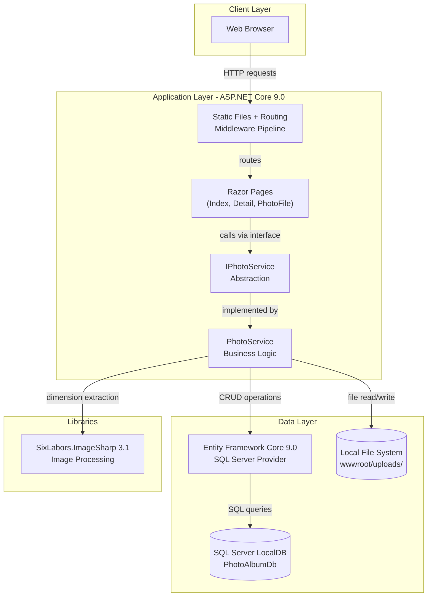
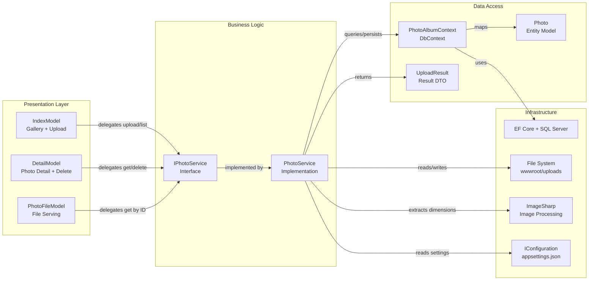

# Architecture Diagram

PhotoAlbum is an ASP.NET Core 9.0 Razor Pages web application for photo gallery management, using SQL Server for persistence and local file storage for uploaded images.

## Application Architecture

### Technology Stack Summary

| Layer | Technology | Version | Purpose |
|-------|-----------|---------|---------|
| Presentation | ASP.NET Core Razor Pages | 9.0 | Server-side web UI rendering |
| Business Logic | PhotoService (custom) | — | Photo upload, retrieval, deletion |
| Data Access | Entity Framework Core | 9.0.9 | ORM for SQL Server |
| Database | SQL Server LocalDB | — | Persistent photo metadata storage |
| File Storage | Local File System | — | Binary image file storage (wwwroot/uploads) |
| Image Processing | SixLabors.ImageSharp | 3.1.11 | Image dimension extraction |

### Data Storage & External Services

The application uses SQL Server LocalDB for storing photo metadata (filename, size, MIME type, dimensions, upload timestamp) and the local file system (`wwwroot/uploads/`) for storing the actual image binary files. There are no external service integrations — all storage is local. File names use GUID-based identifiers to prevent collisions and avoid exposing original file names on disk.

### Key Architectural Decisions

- **Service layer abstraction**: `IPhotoService` interface decouples Razor Pages from storage implementation, enabling a future swap from local file storage to Azure Blob Storage without touching presentation code.
- **Transactional consistency**: On database save failure after file write, the file is deleted to prevent orphaned files on disk.
- **Configuration-driven file handling**: Upload path, max size, and allowed MIME types are all read from `appsettings.json`, enabling environment-specific overrides.

## Component Relationships

### Component Inventory

| Component | Layer | Type | Responsibility |
|-----------|-------|------|---------------|
| IndexModel | Presentation | Razor PageModel | Displays photo gallery grid; handles multi-file upload via POST handler |
| DetailModel | Presentation | Razor PageModel | Displays single photo full-size with metadata; handles photo deletion and pagination navigation |
| PhotoFileModel | Presentation | Razor PageModel | Serves binary photo files by ID with caching headers; provides indirect file access |
| IPhotoService | Business Logic | Interface | Defines contract for photo operations (get all, get by ID, upload, delete) |
| PhotoService | Business Logic | Service | Implements photo upload (with validation, dimension extraction, file write, DB save), retrieval, and deletion with transactional rollback |
| PhotoAlbumContext | Data Access | EF Core DbContext | Manages Photos DbSet; configures entity mappings and descending index on UploadedAt |
| Photo | Data Access | Entity Model | Represents a stored photo with metadata (original/stored filename, path, size, MIME type, dimensions, timestamp) |
| UploadResult | Data Access | DTO | Carries upload operation result (success flag, photo ID, error message) back to calling page |
