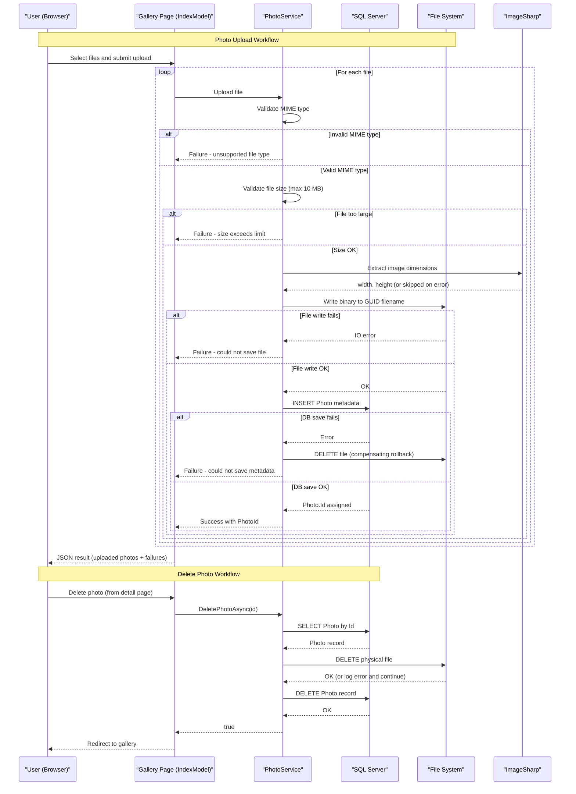

# Core Business Workflows

PhotoAlbum is a personal photo gallery application that allows users to upload, browse, view, and delete photos through a web browser interface.

## Domain Entities

| Entity | Service / Bounded Context | Description | Key Relationships |
|--------|--------------------------|-------------|------------------|
| Photo | Photo Gallery (single bounded context) | Represents an uploaded image with its metadata and storage references | No relationships — sole entity in the domain |

## Service-to-Domain Mapping

| Service | Domain Context | Owned Entities | External Dependencies |
|---------|---------------|---------------|----------------------|
| PhotoAlbum Web | Photo Gallery | Photo | SQL Server (metadata), Local File System (binary images) |

PhotoAlbum is a single-service, single-context application. There are no inter-service data flows or cross-context aggregation patterns.

## Primary Workflows

### Workflow 1: Upload Photos

A user selects one or more image files and submits them via the gallery page. For each file the system validates the MIME type and size, extracts image dimensions, saves the binary to disk, and then records the metadata in the database. Files that fail validation are reported individually without blocking successful uploads. If the database save fails after a file has been written, the file is deleted from disk as a compensating action to prevent orphaned storage.

**Steps:**
1. User selects files and submits the upload form (drag-and-drop or file picker).
2. For each file: validate MIME type against allowed types (JPEG, PNG, GIF, WebP).
3. For each file: validate file size is within the configured maximum (10 MB).
4. For each file: validate the file is not empty.
5. Extract image dimensions (width, height) using ImageSharp — non-blocking; continues without dimensions if extraction fails.
6. Write binary file to disk using a GUID-based filename to prevent collisions and avoid exposing original names.
7. Save photo metadata (original filename, stored filename, path, size, MIME type, dimensions, UTC timestamp) to the database.
8. On database failure: delete the written file (compensating rollback).
9. Return a JSON result listing successfully uploaded photos and any failures.

### Workflow 2: Browse Photo Gallery

A user visits the home page and views all uploaded photos in reverse-chronological order. Photos are displayed as a grid of thumbnails. The page fetches all photo metadata from the database; no pagination is implemented.

**Steps:**
1. User navigates to the home page (`GET /`).
2. Retrieve all `Photo` records ordered by `UploadedAt` descending.
3. Render the gallery grid with each photo's thumbnail and metadata.

### Workflow 3: View Photo Detail & Navigate

A user clicks on a photo to view it full-size along with metadata (filename, dimensions, file size, upload date). Navigation controls allow moving to the next or previous photo in chronological order.

**Steps:**
1. User clicks a photo thumbnail (`GET /Detail?id=N`).
2. Retrieve all photos ordered by `UploadedAt` descending.
3. Locate the target photo by ID within the ordered list.
4. Determine the previous photo (older) and next photo (newer) by list index for navigation.
5. Render the detail page with the full-size image, metadata, and navigation controls.

### Workflow 4: Delete Photo

A user deletes a photo from the detail page. The physical file is removed from disk first, then the database record is deleted. If file deletion fails, the database record is still deleted (best-effort cleanup). The user is redirected back to the gallery after deletion.

**Steps:**
1. User clicks Delete on the detail page (`POST /Detail?handler=Delete&id=N`).
2. Retrieve the `Photo` record by ID.
3. Attempt to delete the physical file from disk.
4. Delete the `Photo` record from the database.
5. Redirect to gallery home page.

### Workflow 5: Serve Photo File

A browser requests a photo binary (for display in the gallery or detail page). The system looks up the photo by ID, resolves the physical file path, reads the bytes, and returns them with appropriate cache headers.

**Steps:**
1. Browser requests photo binary (`GET /PhotoFile?id=N`).
2. Retrieve the `Photo` record by ID to get the stored filename and MIME type.
3. Resolve the physical file path under `wwwroot/uploads/`.
4. Read file bytes and return with the stored MIME type, a 1-year `Cache-Control` header, and an ETag.

## Cross-Service Data Flows

PhotoAlbum is a single-service application. There are no cross-service data flows, API gateway aggregation, or inter-service communication patterns. All data access is in-process via `PhotoService` → `PhotoAlbumContext` (EF Core) → SQL Server, and via direct file system I/O.

The only data split is between the SQL Server database (metadata) and the local file system (binary images). These are coordinated at the application level: upload stores to disk then to the database; delete removes from disk then from the database. Neither operation uses a distributed transaction.

## Business Workflow Sequence

## Business Rules & Decision Logic

### Validation Rules (Upload)

| Rule | Condition | Outcome |
|------|-----------|---------|
| MIME type check | `file.ContentType` must be in `AllowedMimeTypes` (JPEG, PNG, GIF, WebP) | Reject with "File type not supported" message |
| File size check | `file.Length` must be ≤ `MaxFileSizeBytes` (10 MB) | Reject with "File size exceeds N MB limit" message |
| Empty file check | `file.Length` must be > 0 | Reject with "File is empty" message |

### Business Constraints

- **GUID filename generation**: Each uploaded file receives a UUID v4 filename preserving the original extension. This prevents filename collisions and avoids directory traversal risks from user-supplied names.
- **No duplicate detection**: No uniqueness check is performed on content or original filename — the same image can be uploaded multiple times and will receive distinct IDs and stored filenames.
- **No pagination**: All photos are loaded on every gallery page request. Performance degrades linearly as the photo count grows.
- **No authentication or authorisation**: All operations (view, upload, delete) are available to any visitor with no access controls.

### State Transitions

The `Photo` entity has no explicit state machine. It exists in one of two states: **present** (record in DB + file on disk) or **absent** (deleted from both). There is a brief inconsistent window during upload (file written, DB not yet saved) and during deletion (file removed, DB record still present) where the two stores can diverge.

### Transactions & Error Handling

- **Upload**: No distributed transaction. File I/O and DB save are sequential. On DB failure, a compensating file delete is attempted. If the compensating delete also fails, an orphaned file remains on disk (logged as an error but not surfaced to the user).
- **Delete**: No distributed transaction. Physical file is deleted first; if that fails the error is logged and database deletion proceeds regardless. This means a DB record referencing a missing file can result.

### Audit & Logging

- All significant operations (upload success/failure, delete, dimension extraction failure, file I/O errors) are logged via `ILogger<T>` at `Information`, `Warning`, or `Error` levels.
- `UploadedAt` (UTC timestamp) on the `Photo` entity provides a basic audit trail of when each photo was added.
- No change-tracking audit log, soft-delete, or event sourcing is implemented.

### Authorization

No authentication or authorization is implemented. There are no roles, ownership checks, or access policies. All endpoints are publicly accessible.
