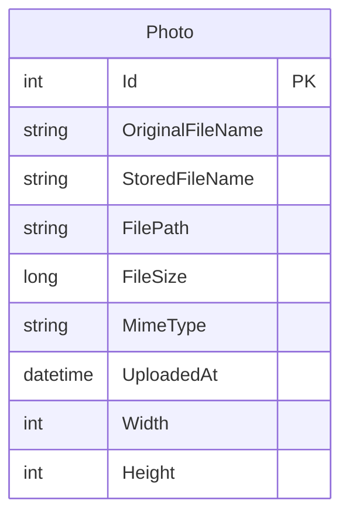

# Data Architecture & Persistence Layer

PhotoAlbum uses a single SQL Server database with one entity (`Photo`) managed via Entity Framework Core 9.0, with schema versioned through EF Core Migrations.

## Database Configuration

| Service | DB Type | Profile | Driver | Connection | Migration Tool |
|---------|---------|---------|--------|-----------|----------------|
| PhotoAlbum Web | SQL Server LocalDB | All (dev/prod) | Microsoft.EntityFrameworkCore.SqlServer 9.0.9 | `(localdb)\mssqllocaldb` — database `PhotoAlbumDb` | EF Core Migrations (auto-applied on startup) |
| PhotoAlbum Tests | In-Memory | Test only | Microsoft.EntityFrameworkCore.InMemory 9.0.9 | In-process memory | None (schema created automatically) |

Schema management: EF Core `MigrateAsync()` is called at application startup (skipped when `IsTestEnvironment=true`). The initial migration creates the `Photos` table with a descending index on `UploadedAt`. No seed data scripts are configured. See `configuration-inventory.md` for full property details.

## Data Ownership per Service

| Service | Tables Owned | ORM Framework | Caching | Notes |
|---------|-------------|--------------|---------|-------|
| PhotoAlbum Web | Photos | EF Core 9.0 | None | Single bounded context; binary files stored on local file system outside the database |

## Entity Model

**Entity notes:**
- `Photo` is the sole entity in the domain model.
- `OriginalFileName` (max 255) — user-supplied name at upload time.
- `StoredFileName` (max 255) — GUID-based filename written to disk (e.g., `3f2504e0-4f89-11d3-9a0c-0305e82c3301.jpg`).
- `FilePath` (max 500) — relative path from `wwwroot` (e.g., `/uploads/<guid>.jpg`).
- `Width` and `Height` are nullable; populated by ImageSharp at upload time.
- `UploadedAt` uses UTC datetime; a descending index (`IX_Photos_UploadedAt`) optimises the default chronological gallery query.

## Key Repository Methods

| Service | Repository / Access Pattern | Notable Methods | Purpose |
|---------|----------------------------|----------------|---------|
| PhotoAlbum Web | `PhotoAlbumContext` (EF Core DbContext — direct usage, no repository interface) | `Photos.OrderByDescending(p => p.UploadedAt).ToListAsync()` | Returns all photos newest-first for gallery display |
| PhotoAlbum Web | `PhotoAlbumContext` | `Photos.FindAsync(id)` | Single photo lookup by PK for detail view and file serving |
| PhotoAlbum Web | `PhotoAlbumContext` | `Photos.AddAsync(photo)` + `SaveChangesAsync()` | Persists new photo entity after file write |
| PhotoAlbum Web | `PhotoAlbumContext` | `Photos.Remove(photo)` + `SaveChangesAsync()` | Deletes photo record after physical file deletion |

No repository interface layer (e.g., `IRepository<T>`) is present. `PhotoService` directly instantiates and calls `PhotoAlbumContext` via constructor-injected DI. No named queries, stored procedures, or raw SQL are used.

## Caching Strategy

No caching layer is configured for database queries or entity data. The application does not use `IMemoryCache`, `IDistributedCache`, Redis, or any second-level EF Core cache.

HTTP-level caching is applied for served image files:
- Binary photo responses from `/PhotoFile?id=N` include `Cache-Control: public, max-age=31536000` (1 year) and an `ETag` based on photo ID and upload timestamp.
- Static assets served from `wwwroot` carry `Cache-Control: public, max-age=3600` (1 hour).

These are response-header caches handled by the browser and any CDN/proxy, not a server-side data cache.

## Data Ownership Boundaries

PhotoAlbum is a single-service application with a single shared SQL Server database instance. There is no service-to-service data access, no shared database across services, and no cross-service query patterns.

Data is split across two physical stores owned entirely by one service:
- **SQL Server (`Photos` table):** metadata (filenames, size, MIME type, dimensions, timestamp).
- **Local file system (`wwwroot/uploads/`):** binary image data, referenced by `StoredFileName`.

These two stores are not transactionally consistent with each other. Consistency is maintained by application-level compensating logic: if the database save fails after the file has been written, the file is deleted. However, if the file deletion also fails (e.g., I/O error), orphaned files on disk can result.

No CQRS, event sourcing, or outbox patterns are in use. All reads and writes go through the same `PhotoAlbumContext` instance.

### Data Classification & Sensitivity

| Entity | Sensitive Fields | Classification | Controls in Place |
|--------|-----------------|---------------|-------------------|
| Photo | `OriginalFileName` (may reflect user-provided names) | Low sensitivity — filenames only | None — no encryption-at-rest, masking, or access controls configured |

No PII (names, addresses, email), PHI (health records), or PCI (payment data) is stored in the database. `OriginalFileName` retains the user-supplied filename which could indirectly identify a person in some contexts, but no personal profile or identity data is collected. File binary content (images) may contain EXIF metadata with location or personal information; no EXIF stripping is performed on upload.
