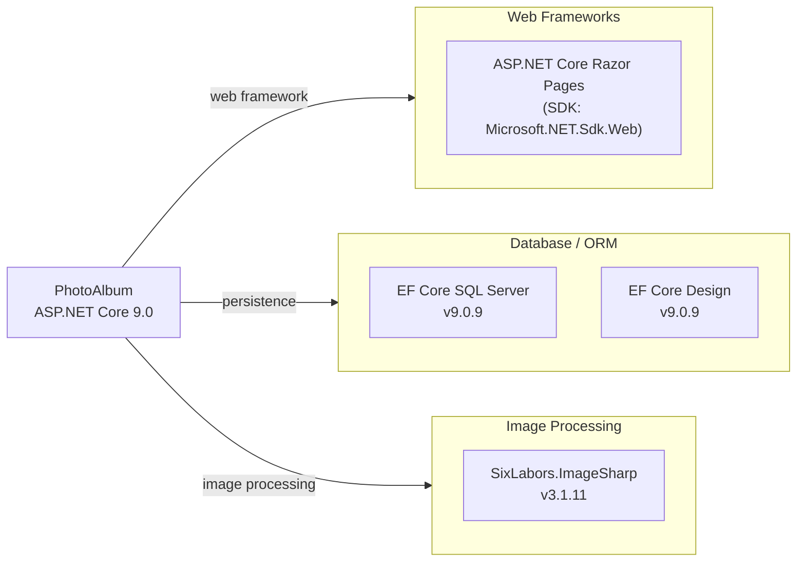

# Dependency Map

PhotoAlbum is an ASP.NET Core 9.0 application with 3 production dependencies and 6 test-scoped dependencies across 2 projects.

## Dependencies

### Dependency Summary

| Category | Count | Key Libraries | Notes |
|----------|-------|--------------|-------|
| Web Frameworks | 1 | ASP.NET Core Razor Pages (SDK) | Included via Microsoft.NET.Sdk.Web SDK; targets net9.0 |
| Database / ORM | 2 | Microsoft.EntityFrameworkCore.SqlServer 9.0.9, Microsoft.EntityFrameworkCore.Design 9.0.9 | EF Design is private/build-only (not deployed) |
| Image Processing | 1 | SixLabors.ImageSharp 3.1.11 | Used for extracting image dimensions on upload |

### Version & Compatibility Risks

All production dependencies target .NET 9.0, which is a current supported release (STS). Entity Framework Core 9.0.9 and ASP.NET Core 9.0 are up-to-date as of this assessment. SixLabors.ImageSharp 3.1.11 is a recent stable release. The main migration risk is the reliance on **SQL Server LocalDB** (via `(localdb)\mssqllocaldb` connection string) for persistence, which is a Windows-only developer tool not suitable for cloud or containerized deployment. Moving to Azure SQL or another cloud-compatible database will require a connection string change and potentially driver configuration updates.

### Notable Observations

- **Minimal dependency footprint**: Only 3 production NuGet packages beyond the ASP.NET Core SDK, making this a lean, easy-to-modernize application.
- **No logging framework declared**: The application uses the built-in ASP.NET Core `ILogger<T>` abstraction backed by the default console provider — no third-party logging library (Serilog, NLog) is configured.
- **Local file storage only**: There is no cloud storage SDK (e.g., Azure.Storage.Blobs, AWSSDK.S3) declared; all file storage is local disk, which is a blocker for horizontal scaling and cloud deployment.
- **EF Core Design as PrivateAssets**: `Microsoft.EntityFrameworkCore.Design` is correctly scoped to build/design time only and will not be included in the published output.

## Test Dependencies

| Framework / Library | Version | Notes |
|--------------------|---------|-------|
| xunit | 2.9.2 | Primary test framework |
| xunit.runner.visualstudio | 2.8.2 | Visual Studio / dotnet test runner integration |
| Microsoft.NET.Test.Sdk | 17.12.0 | .NET test host SDK |
| Microsoft.AspNetCore.Mvc.Testing | 9.0.9 | Integration testing with in-process test server |
| Microsoft.EntityFrameworkCore.InMemory | 9.0.9 | In-memory EF Core provider for unit tests |
| coverlet.collector | 6.0.2 | Code coverage collection |

Total test-scope dependencies: 6

All test dependencies are current and well-aligned with the production stack. The combination of `Microsoft.AspNetCore.Mvc.Testing` and `Microsoft.EntityFrameworkCore.InMemory` enables full integration tests without requiring an external database, which is good practice. No mocking framework (e.g., Moq, NSubstitute) is included, suggesting tests rely on real implementations or the in-memory EF provider.
